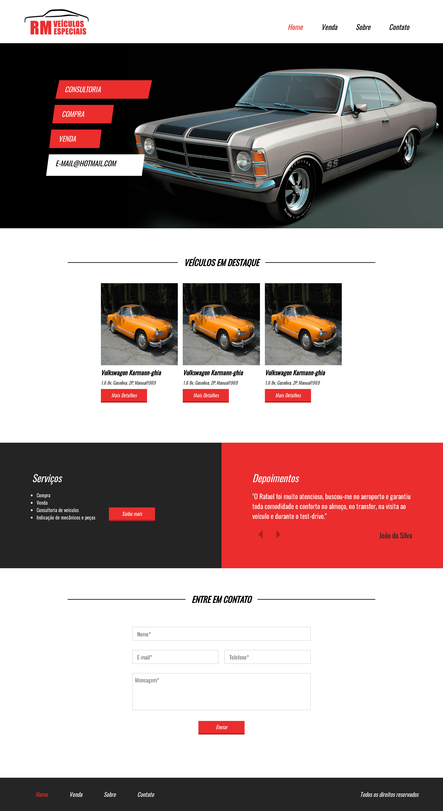
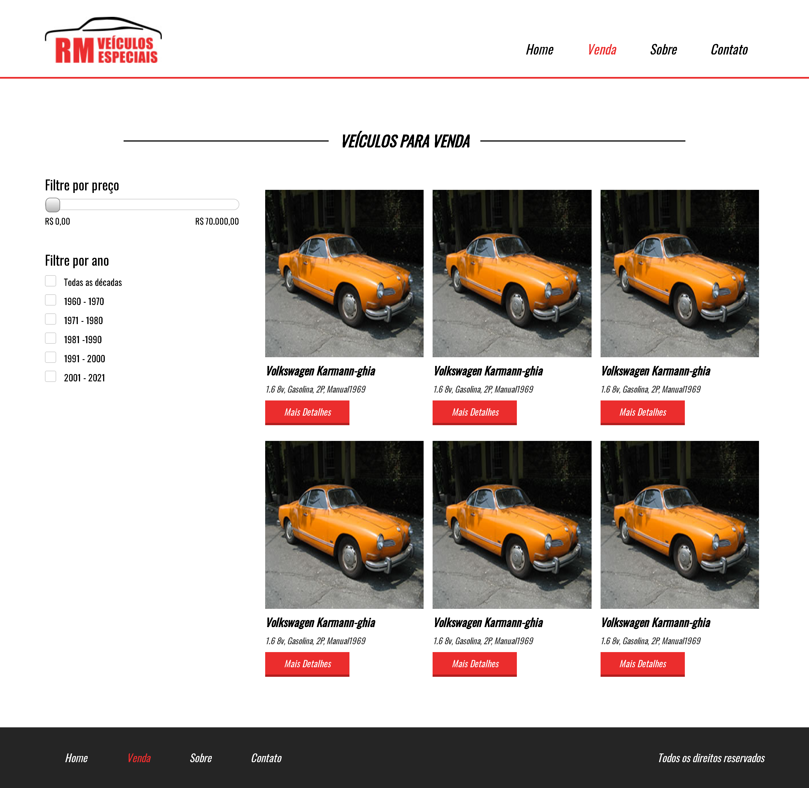
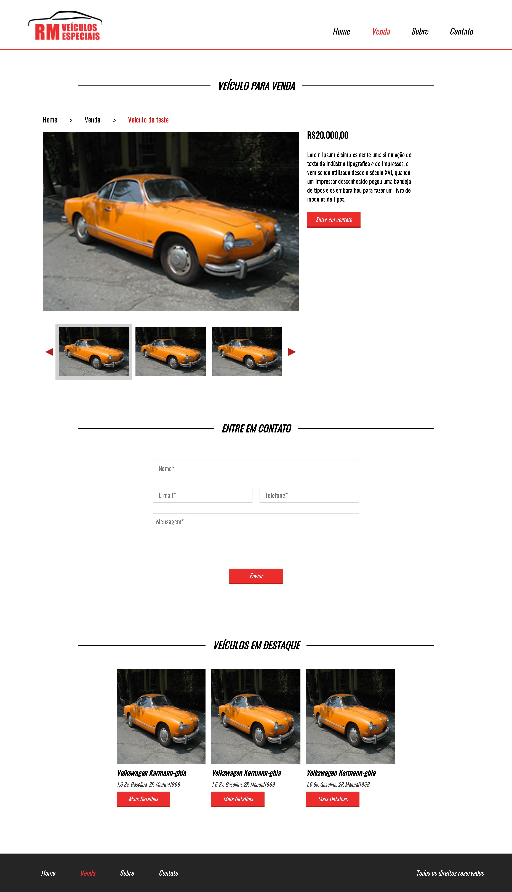

<h1 style="text-align: center; font-weight: bold;">Plataforma de revenda de veículos</h1>

## Demonstração 📸

  
  
  

---

## 🚀 Sobre o Projeto

Trabalho final da disciplina "Reuso de software e metodologias ágeis" do curso de Engenharia da Computação da Universidade Federal de Alagoas.

Este trabalho foi idealizado pelo aluno Leandro Araújo da Silva.

Este trabalho final consiste na elaboração de um framework para a filtragem de veículos.

Link do projeto: http://loja-de-carros.vercel.app/

### 🛠 Tecnologias

As seguintes ferramentas foram usadas na construção do projeto:

- [HTML5]
- [CSS3]
- [JavaScript]
- [jQuery]
- [Bootstrap]
- [FormSubmit]
---

 

Veja meu Linkedin: [LEANDRO ARAÚJO](https://www.linkedin.com/in/leandro-araujo-silva01/)